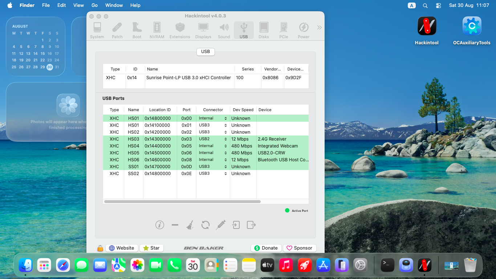

# macOS Tahoe on Dell Inspiron 15 3567

> ⚠️ For learning/testing. Do not use for production or infringe Apple EULA.

---

## 💻 Specifications
- **Model**: Dell Inspiron 15 3567
- **CPU**: Intel Core i3-7020U (Kaby Lake, 2.30 GHz)
- **iGPU**: Intel HD Graphics 620
- **Display**: 15.6" HD (1366×768), TN
- **RAM**: (your config)
- **Storage**: (your config)
- **USB**: 1×USB 2.0, 2×USB 3.0
- **Wi-Fi / BT**: Intel AC 3165
- **Ethernet**: Realtek RTL810xE PCIe Fast Ethernet
- **Audio**: Realtek ALC256 (HDA Controller)

---

## ✅ Working
- Intel HD Graphics 620 (1536 MB VRAM)
- CPU Power Management
- Restart & Shutdown
- Ethernet (RTL810xE)
- Audio
  - via **VoodooHDA for Tahoe** (by chris1111), **or**
  - via **OCLP-X patch** (by JeoJay127)
- Brightness keys (F11, F12)
- Volume keys (F1, F2, F3)
- Touchpad
- HDMI Output
- All USB Ports  
  - using **USBToolbox.kext v1.2.0** + **UTBMap.kext**
- SD Card Reader
- Bluetooth

## ❌ Not Working (as of Tahoe Beta 8)
- **Wi-Fi** (Intel AC3165 not working on Sonoma Tahoe Beta 8)
- **AirDrop** (requires supported Broadcom/AMDWlan; Intel iwl not supported for AirDrop)

---

## 🧩 Kexts & Tools (reference)
| Component | Kext/Tool | Purpose / Notes |
|---|---|---|
| USB | `USBToolbox.kext` + `UTBMap.kext` | Enables proper USB port mapping (v1.2.0 used) |
| Audio | `VoodooHDA` (Tahoe build) **or** OCLP-X patch | Restores ALC256 audio output/input |
| Ethernet | `RealtekRTL8100.kext` / `RTL8111.kext` (depending on controller) | RTL810xE Fast Ethernet |
| Graphics | `WhateverGreen.kext` | iGPU patches, framebuffer fixes |
| Lilu | `Lilu.kext` | Dependency for many patches |
| SMC | `VirtualSMC.kext` (+ plugins) | SMC emulation |
| PS2 / Trackpad | `VoodooPS2Controller.kext` | Keyboard/trackpad (if not I2C) |
| Battery (opt) | `SMCBatteryManager.kext` / `ACPIBatteryManager.kext` | Battery status |
| NVRAM (opt) | `RestrictEvents.kext` | Prevents certain panics/spoofs |
| Wi-Fi (alt HW) | Broadcom (DW1560/DW1830) + `AirportBrcmFixup.kext` | Needed for native Wi-Fi + AirDrop |

> ℹ️ Intel AC3165 Wi-Fi currently **not** working on Tahoe Beta 8. Consider a Broadcom replacement card for continuity features.

---

## 🛠️ BIOS/UEFI Suggested Settings
- Disable **Secure Boot**
- Disable **Fast Boot**
- **SATA**: AHCI
- Enable **UEFI** boot mode
- If available: disable **CFG-Lock** (or patch via OpenCore)
- DVMT Pre-Alloc 64MB (if configurable; WhateverGreen can work around)

---

## 🖼️ Screenshots
**Specs:**
 

**USB(Use USBToolbox Kext 1.2.0 & UTBMap.kext):**

